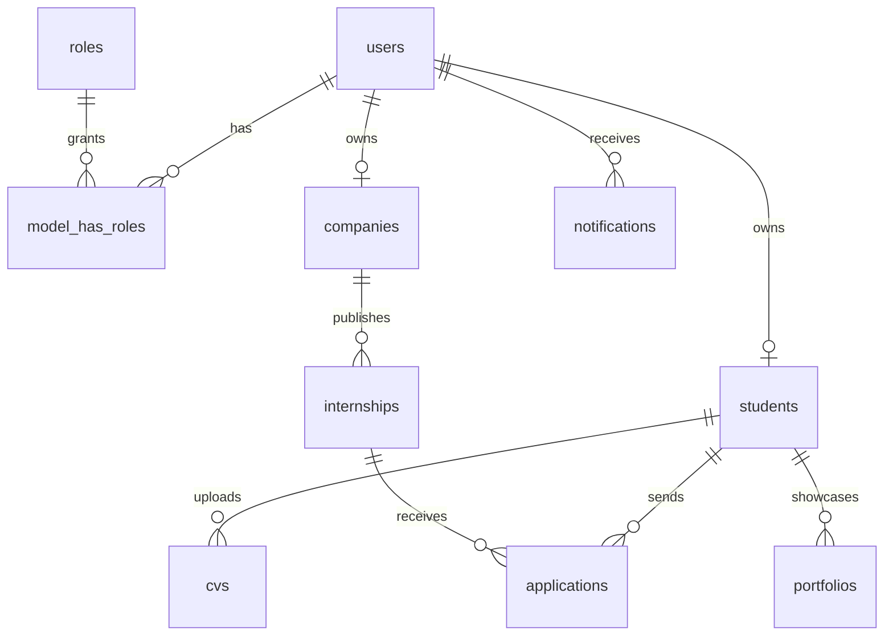

# Architecture Stagium

## Décisions structurantes

- **Frontend API-first** : Next.js 15, App Router, TypeScript strict, Tailwind CSS, composants inspirés shadcn/ui, TanStack Query pour les données serveur et Zustand pour la session locale.
- **Backend modulaire** : Laravel 12 API versionnée sous `/api/v1`, modules métier isolés (`Auth`, `Internships`, `Applications`, `Matching`, `Admin`) avec Controller → Service → Repository → DTO.
- **PostgreSQL relationnel** : UUID, indexes sur filtres fréquents, JSONB pour attributs évolutifs de profil et tags d'offres.
- **Sécurité MVP** : JWT, refresh-token table, RBAC, vérification email, rate limiting, validation stricte, headers sécurité, hash Laravel.
- **IA-ready** : `MatchingService` découple le scoring actuel pour évoluer vers embeddings, parsing CV, LLM career assistant et recommandations temps réel.

## Diagramme relationnel simplifié

## Modules produit MVP

1. Authentification : register étudiant/entreprise, login, logout, refresh, email verification, RBAC.
2. Profils étudiants : bio, académie, compétences, technologies, expériences, projets, CV, portfolio, préférences.
3. Entreprises : profil, validation, publication offres, pipeline candidats.
4. Offres : CRUD API, recherche filtrée, tags, pagination.
5. Candidatures : postuler, documents, suivi statut.
6. Dashboards : étudiant, entreprise, admin.
7. Matching : score explicable et extensible.
8. Notifications : persistance, payload JSON, extension emails/temps réel.
9. Administration : analytics basiques, modération et monitoring.
